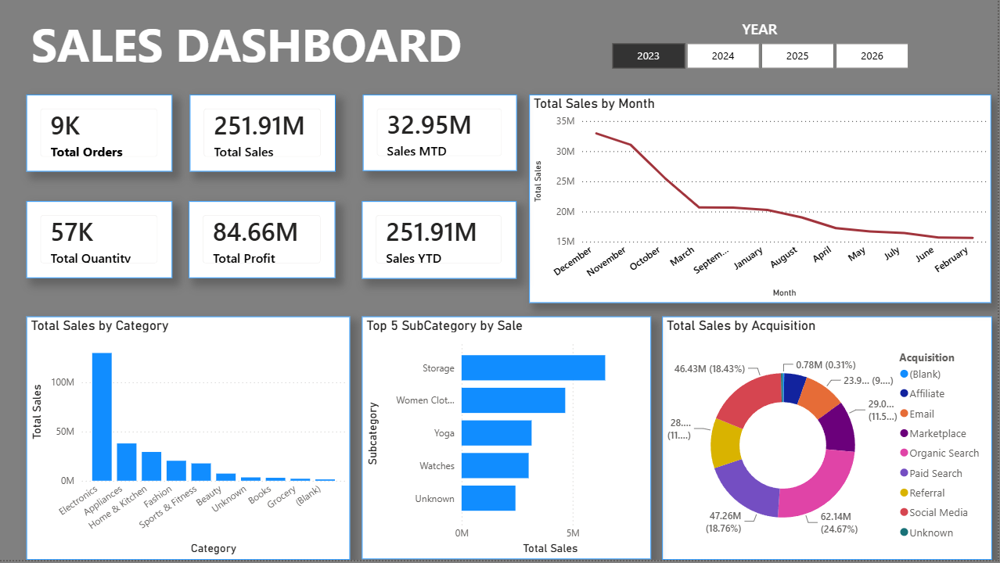
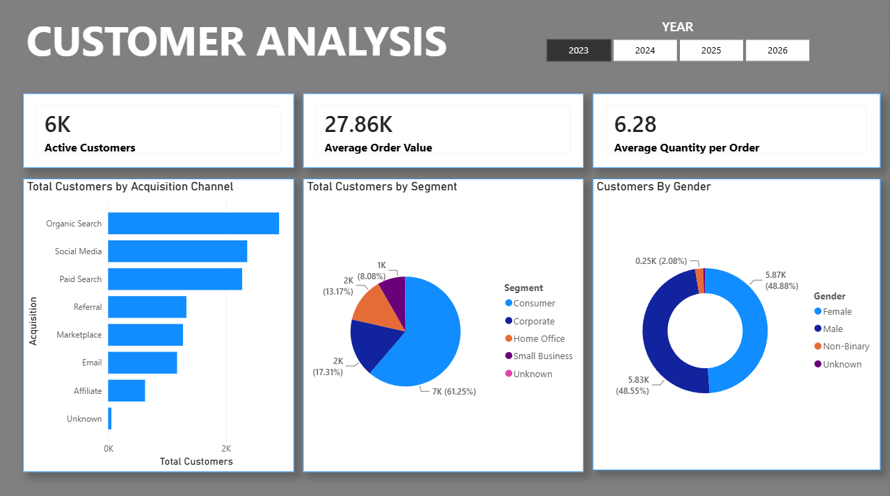

# ecommerce-sales-analysis

# E-Commerce Sales Analysis

## 📊 Project Overview

This project is an end-to-end **E-Commerce Data Analysis project** focused on data cleaning, transformation, analysis, and business dashboarding.

The project uses **Python in Jupyter Notebook** to clean and prepare raw e-commerce datasets, followed by **Power BI** to create interactive dashboards for analyzing sales and customer performance.

### Project Workflow

**Raw Data → Jupyter Notebook → Data Cleaning → Cleaned Data → Power BI → Interactive Dashboard**

---

## 🎯 Project Objectives

* Clean and prepare raw e-commerce data
* Identify and handle missing values
* Detect duplicate records
* Correct data types
* Identify invalid and inconsistent values
* Validate cleaned data
* Analyze sales performance
* Analyze customer performance
* Create interactive Power BI dashboards
* Present business insights through data visualization

---

## 🛠️ Tools & Technologies

* **Python**
* **Jupyter Notebook**
* **Pandas**
* **NumPy**
* **Power BI**
* **DAX**
* **CSV**

> NumPy and DAX are included only where they are actually used in the project.

---

## 🔄 Project Workflow

### 1. Raw Data

The project starts with raw CSV datasets containing e-commerce business data.

The raw data contains information related to areas such as:

* Customers
* Products
* Orders
* Sales

---

### 2. Data Cleaning — Jupyter Notebook

Data cleaning and preparation were performed using **Python and Pandas in Jupyter Notebook**.

The cleaning process included:

* Missing value analysis
* Duplicate detection
* Data type checking
* Date conversion
* Invalid value detection
* Handling missing values
* Numeric value cleaning
* Rounding numeric columns
* Consistency checks
* Data validation

The complete cleaning process is available in:

**`python-notebook/ecommerce_data_cleaning.ipynb`**

---

### 3. Cleaned Data

After the cleaning process, the processed datasets were exported into the `cleaned` folder.

These cleaned datasets were then used as the source for the Power BI analysis.

---

# 📊 Power BI Dashboard

The cleaned datasets were imported into Power BI to create interactive dashboards.

## Sales Dashboard

The Sales Dashboard provides an overview of sales performance through KPIs and visualizations.

Key areas include:

* Sales performance
* Revenue trends
* Product performance
* Category performance
* Brand performance
* Profit analysis



---

## Customer Dashboard

The Customer Dashboard focuses on customer-related analysis.

Key areas include:

* Customer performance
* Customer distribution
* Customer purchasing behavior
* Customer sales contribution



---

# 📁 Project Structure

```text
ecommerce-sales-analysis/
│
├── README.md
│
├── raw/
│   └── Raw CSV datasets
│
├── cleaned/
│   └── Cleaned CSV datasets
│
├── python-notebook/
│   └── ecommerce_data_cleaning.ipynb
│
└── powerbi-dashboard/
    ├── Dashboard.pbix
    ├── Dashboard_Customers.png
    └── Dashboard_Sales.png
```

---

# 💡 Key Skills Demonstrated

### Data Cleaning

* Missing value handling
* Duplicate detection
* Data type correction
* Data validation
* Data transformation
* Data quality checks

### Python

* Pandas
* Jupyter Notebook
* DataFrame manipulation
* Data inspection
* Data transformation

### Power BI

* Data modeling
* Relationships
* DAX measures
* KPI development
* Interactive dashboards
* Data visualization
* Business reporting

---

# 🚀 Project Outcome

The project demonstrates the complete process of transforming raw e-commerce data into cleaned datasets and interactive Power BI dashboards.

It showcases practical skills in:

**Data Cleaning → Data Preparation → Data Analysis → Data Visualization → Business Reporting**

---

## 👤 Author

**Sumit**

B.Sc. Computer Science Graduate | Aspiring Data Analyst

**Skills:** Python • Pandas • Power BI • DAX • Excel
